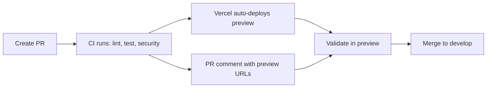
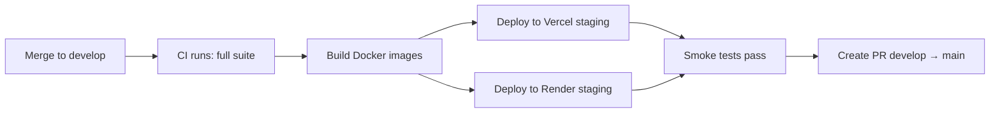
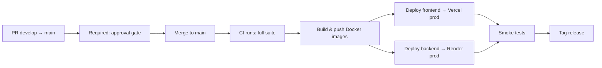

# ValueSkins Environment Architecture

## Overview

```
┌─────────────┐     ┌─────────────┐     ┌─────────────┐
│   Preview    │────▶│   Staging   │────▶│ Production  │
│  (per PR)    │     │  (develop)  │     │   (main)    │
└─────────────┘     └─────────────┘     └─────────────┘
      ▲                    ▲                    ▲
      │                    │                    │
  Auto-deploy         Auto-deploy          Approval
  on PR open          on push to           gate required
                      develop
```

## Environment Table

| Environment | Branch | Trigger | Frontend URL | Marketplace URL | Backend URL | Approval Required |
|---|---|---|---|---|---|---|
| **Preview** | PR branch | PR opened/synced | `pr-{N}.valueskins.pages.dev` | `pr-{N}-mkt.valueskins.pages.dev` | Render preview | No |
| **Staging** | `develop` | Push to `develop` | `staging.valueskins.com` | `staging-marketplace.valueskins.com` | `api-staging.valueskins.com` | No |
| **Production** | `main` | Push to `main` | `valueskins.com` | `marketplace.valueskins.com` | `api.valueskins.com` | **Yes — required reviewer** |

## Deployment Flow

### 1. Preview (Pull Request)



- **Trigger**: Opening or updating a PR against `develop` or `main`
- **What happens**: CI checks + Vercel preview deployment
- **URL**: Auto-generated by Vercel, posted as PR comment
- **DB**: Shared staging database
- **Who can see**: Anyone with the preview URL

### 2. Staging



- **Trigger**: Push to `develop` branch
- **What happens**: Full CI + staging deploy via `staging.yml`
- **URL**: `https://staging.valueskins.com`
- **DB**: Staging Postgres (separate from production)
- **Who can see**: Team, testers, stakeholders
- **Data**: Anonymized production data or test data

### 3. Production



- **Trigger**: Push to `main` branch
- **What happens**: CI + approval gate + deploy via `production.yml`
- **URL**: `https://valueskins.com`
- **DB**: Production Postgres
- **Approval**: Required via GitHub Environments (`production` environment)
- **Rollback**: Revert PR and deploy; or use Vercel's instant rollback

## Required Secrets

### Vercel (set in GitHub Secrets)

| Secret | Description |
|---|---|
| `VERCEL_TOKEN` | Vercel API token (create at vercel.com/account/tokens) |
| `VERCEL_ORG_ID` | Vercel org ID (from `.vercel/project.json`) |
| `VERCEL_PROJECT_ID_FRONTEND` | Frontend project ID (`prj_A5W5r1UPYgLbPX9K7nWG7ag0f1oa`) |
| `VERCEL_PROJECT_ID_MARKETPLACE` | Marketplace project ID (`prj_i0qnqZc1FeGxMQ92pKR2JDVCS2yE`) |

### Render (set in GitHub Secrets)

| Secret | Description |
|---|---|
| `RENDER_API_KEY` | Render API token (dashboard.render.com → Account Settings) |
| `RENDER_STAGING_SERVICE_ID` | Staging backend service ID |
| `RENDER_PRODUCTION_SERVICE_ID` | Production backend service ID |

### Database

| Secret | Description |
|---|---|
| `DATABASE_URL_PROD` | Production Postgres connection string |
| `DATABASE_URL_STAGING` | Staging Postgres connection string |

## Branch Protection Rules

### `main` branch (Required)

- [x] Require pull request before merging
- [x] Require approvals (1 minimum)
- [x] Require status checks to pass (CI / lint / test-backend / test-frontend / security)
- [x] Require branches to be up-to-date
- [x] Require conversation resolution
- [x] Include administrators
- [x] Restrict push: only `develop` → `main` PRs

### `develop` branch (Recommended)

- [x] Require pull request before merging
- [x] Require status checks to pass (CI)
- [x] Require branches to be up-to-date
- [x] Include administrators

## GitHub Environments Configuration

Configure these in `Settings → Environments`:

### `preview` environment
- No protection rules (auto-deploy)
- Used for PR previews

### `staging` environment
- No protection rules (auto-deploy from develop)
- URL: `https://staging.valueskins.com`

### `production` environment
- **Required reviewers**: 1 (admin/lead)
- **Wait timer**: 0 minutes
- URL: `https://valueskins.com`
- Protected branches: `main`

## Rolling Back

### Frontend / Marketplace (Vercel)
```bash
# Instant rollback via Vercel dashboard
vercel rollback --token=$VERCEL_TOKEN

# Or from the Vercel dashboard:
# → Deployments → select previous → "Promote to Production"
```

### Backend (Render)
```bash
# Via Render dashboard:
# → Dashboard → valueskins-api → Manual Deploy → Deploy previous commit
```

## Monitoring & Health

| Environment | Health Check |
|---|---|
| Staging | `https://api-staging.valueskins.com/health` |
| Production | `https://api.valueskins.com/health` |

Check workflow runs:
- [Preview Deploys](https://github.com/redleg789/Valueskins---final-/actions/workflows/preview.yml)
- [Staging Deploys](https://github.com/redleg789/Valueskins---final-/actions/workflows/staging.yml)
- [Production Deploys](https://github.com/redleg789/Valueskins---final-/actions/workflows/production.yml)
