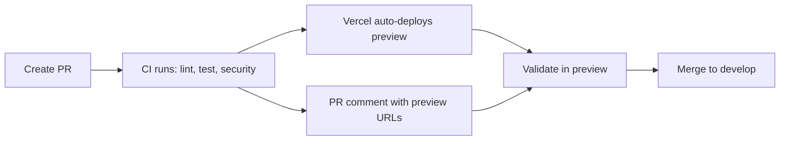
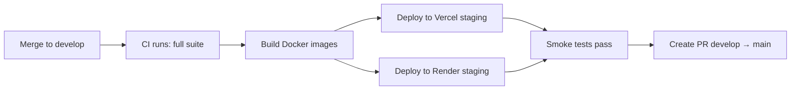
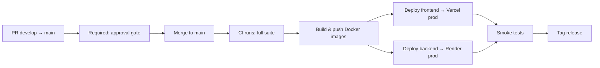

# ValueSkins Environment Architecture

> **Status: 🚧 Workflows staged, setup incomplete**
>
> All workflow files and configs are committed on `develop`. The following
> manual steps are still needed before the pipeline is live:
> 1. Merge `develop` → `main`
> 2. Set GitHub secrets (see [Required Secrets](#required-secrets))
> 3. Create GitHub environments (see [GitHub Environments](#github-environments-configuration))
> 4. Enable branch protection (see [Branch Protection](#branch-protection-rules))
> 5. Create staging backend on Render
> 6. Enable Vercel Git integration for preview aliases

## Overview

```
┌─────────────┐     ┌─────────────┐     ┌─────────────┐
│   Preview    │────▶│   Staging   │────▶│ Production  │
│  (per PR)    │     │  (develop)  │     │   (main)    │
└─────────────┘     └─────────────┘     └─────────────┘
      ▲                    ▲                    ▲
      │                    │                    │
  Auto-deploy         Auto-deploy          Approval
  on PR open          on push to           gate required
                      develop
```

## Environment Table

| Environment | Branch | Trigger | Frontend URL | Marketplace URL | Backend URL | Approval Required |
|---|---|---|---|---|---|---|
| **Preview** | PR branch | PR opened/synced | `pr-{N}.valueskins.pages.dev` | `pr-{N}-mkt.valueskins.pages.dev` | Render preview | No |
| **Staging** | `develop` | Push to `develop` | `staging.valueskins.com` | `staging-marketplace.valueskins.com` | `api-staging.valueskins.com` | No |
| **Production** | `main` | Push to `main` | `valueskins.com` | `marketplace.valueskins.com` | `api.valueskins.com` | **Yes — required reviewer** |

## Deployment Flow

### 1. Preview (Pull Request)



- **Trigger**: Opening or updating a PR against `develop` or `main`
- **What happens**: CI checks + Vercel preview deployment
- **URL**: Auto-generated by Vercel, posted as PR comment
- **DB**: Shared staging database
- **Who can see**: Anyone with the preview URL

### 2. Staging



- **Trigger**: Push to `develop` branch
- **What happens**: Full CI + staging deploy via `staging.yml`
- **URL**: `https://staging.valueskins.com`
- **DB**: Staging Postgres (separate from production)
- **Who can see**: Team, testers, stakeholders
- **Data**: Anonymized production data or test data

### 3. Production



- **Trigger**: Push to `main` branch
- **What happens**: CI + approval gate + deploy via `production.yml`
- **URL**: `https://valueskins.com`
- **DB**: Production Postgres
- **Approval**: Required via GitHub Environments (`production` environment)
- **Rollback**: Revert PR and deploy; or use Vercel's instant rollback

## Required Secrets

### Vercel (set in GitHub Secrets)

| Secret | Description |
|---|---|
| `VERCEL_TOKEN` | Vercel API token (create at vercel.com/account/tokens) |
| `VERCEL_ORG_ID` | Vercel org ID (from `.vercel/project.json`) |
| `VERCEL_PROJECT_ID_FRONTEND` | Frontend project ID (`prj_A5W5r1UPYgLbPX9K7nWG7ag0f1oa`) |
| `VERCEL_PROJECT_ID_MARKETPLACE` | Marketplace project ID (`prj_i0qnqZc1FeGxMQ92pKR2JDVCS2yE`) |

### Render (set in GitHub Secrets)

| Secret | Description |
|---|---|
| `RENDER_API_KEY` | Render API token (dashboard.render.com → Account Settings) |
| `RENDER_STAGING_SERVICE_ID` | Staging backend service ID |
| `RENDER_PRODUCTION_SERVICE_ID` | Production backend service ID |

### Database

| Secret | Description |
|---|---|
| `DATABASE_URL_PROD` | Production Postgres connection string |
| `DATABASE_URL_STAGING` | Staging Postgres connection string |

## Branch Protection Rules

### `main` branch (Required)

- [x] Require pull request before merging
- [x] Require approvals (1 minimum)
- [x] Require status checks to pass (CI / lint / test-backend / test-frontend / security)
- [x] Require branches to be up-to-date
- [x] Require conversation resolution
- [x] Include administrators
- [x] Restrict push: only `develop` → `main` PRs

### `develop` branch (Recommended)

- [x] Require pull request before merging
- [x] Require status checks to pass (CI)
- [x] Require branches to be up-to-date
- [x] Include administrators

## GitHub Environments Configuration

Configure these in `Settings → Environments`:

### `preview` environment
- No protection rules (auto-deploy)
- Used for PR previews

### `staging` environment
- No protection rules (auto-deploy from develop)
- URL: `https://staging.valueskins.com`

### `production` environment
- **Required reviewers**: 1 (admin/lead)
- **Wait timer**: 0 minutes
- URL: `https://valueskins.com`
- Protected branches: `main`

## Rolling Back

### Frontend / Marketplace (Vercel)
```bash
# Instant rollback via Vercel dashboard
vercel rollback --token=$VERCEL_TOKEN

# Or from the Vercel dashboard:
# → Deployments → select previous → "Promote to Production"
```

### Backend (Render)
```bash
# Via Render dashboard:
# → Dashboard → valueskins-api → Manual Deploy → Deploy previous commit
```

## Monitoring & Health

| Environment | Health Check |
|---|---|
| Staging | `https://api-staging.valueskins.com/health` |
| Production | `https://api.valueskins.com/health` |

Check workflow runs:
- [Preview Deploys](https://github.com/redleg789/Valueskins---final-/actions/workflows/preview.yml)
- [Staging Deploys](https://github.com/redleg789/Valueskins---final-/actions/workflows/staging.yml)
- [Production Deploys](https://github.com/redleg789/Valueskins---final-/actions/workflows/production.yml)

## Diagnosing "backend not working" from the field

When a visitor (investor, beta tester) reports the backend is down but it works on a
dev machine, the app now tells you exactly which of two problems it is:

**1. Frontend is calling the wrong URL (the #1 cause)**

The browser reads `NEXT_PUBLIC_BACKEND_URL` **at build time** from the Vercel
environment. If it is unset, the code falls back to `http://localhost:8080` — which
means *every visitor's browser tries to reach localhost:8080 on their own laptop*,
fails, and reports "backend not working." It works for the developer only because
they happen to run the backend on their own localhost:8080.

How to see it live:
- Open the deployed site in any browser and press F12 → Console. On boot the app logs
  a banner: `[diag] ValueSkins frontend boot — backend URL: ...`. If it says
  `localhost:8080` with the warning about the localhost default, this is the cause.
- Or open the site with `?diag=1` to show the diagnostics panel (resolved URLs,
  MOCK_API flag, recent API calls, and a "Probe backend" button).

Fix (Vercel → Project → Settings → Environment Variables, then redeploy):
```
NEXT_PUBLIC_BACKEND_URL=https://valueskins-api.onrender.com
NEXT_PUBLIC_WS_URL=wss://valueskins-api.onrender.com/ws
```
Set them in the **Production** environment (and match `ALLOWED_ORIGINS` on the
backend, e.g. `https://valueskins.com,https://www.valueskins.com`).

**2. The deployed backend itself is unreachable / unhealthy**

- Open `/api/backend-health` on the deployed site (runs from Vercel's network, not
  the visitor's browser). It probes `https://valueskins-api.onrender.com/health`
  server-side and reports reachable vs. not, HTTP status, latency, and a note
  explaining what it found.
- Check Render → Dashboard → `valueskins-api` → Logs. Every request that reaches the
  gateway is logged with method/path/status/duration by `RequestLogger`; CORS
  rejections are logged with the rejected `origin`. If the visitor's calls never
  appear there, the browser was not hitting the backend (see cause #1).
- Browser console also logs every API call with a `[diag] FAIL <METHOD> <FULL URL>` line.
